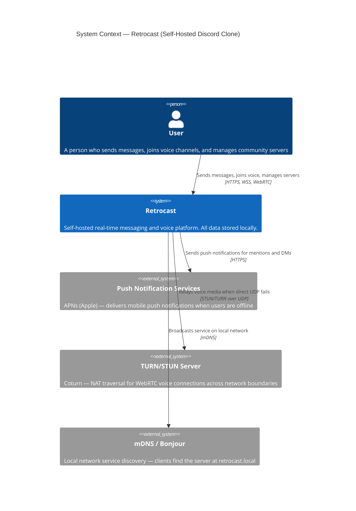
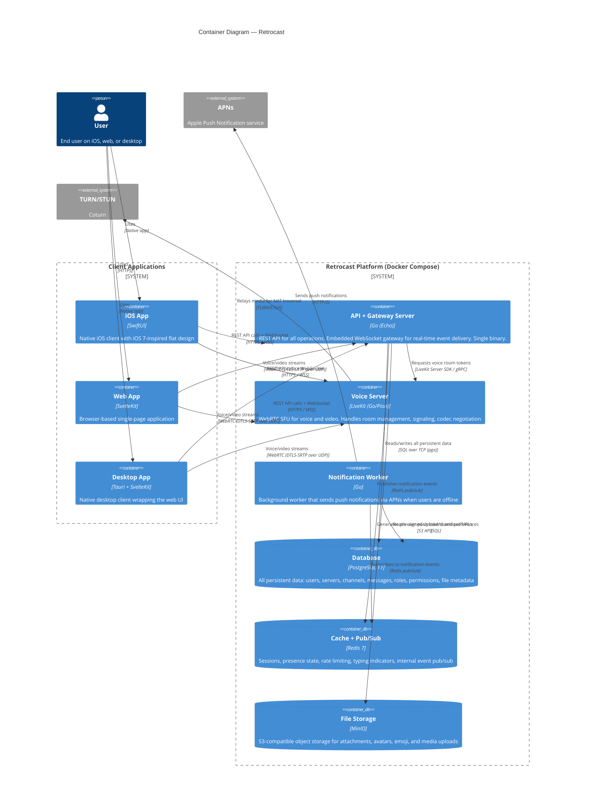

# Retrocast — A Self-Hosted Discord Clone

> A local, privacy-first Discord clone inspired by the simplicity of Discord circa 2015–2016, rebuilt with modern technology for a small friend group to self-host.

---

## Table of Contents

1. [Vision](#vision)
2. [What Discord Was (2015–2016)](#what-discord-was-20152016)
3. [Original Discord Architecture](#original-discord-architecture)
4. [Modern Tech Stack Recommendations](#modern-tech-stack-recommendations)
5. [C4 Model — Level 1: System Context](#c4-model--level-1-system-context)
6. [C4 Model — Level 2: Container Diagram](#c4-model--level-2-container-diagram)
7. [Data Flow Walkthroughs](#data-flow-walkthroughs)
8. [Database Schema Overview](#database-schema-overview)
9. [Deployment Architecture](#deployment-architecture)
10. [Security Model](#security-model)
11. [Feature Scope](#feature-scope)

---

## Vision

Build a self-hosted messaging and voice platform that captures the spirit of early Discord — before Nitro, before Activities, before bloat. Just servers, channels, voice chat, and friends. The aesthetic targets the iOS 7 era: flat design, translucent panels, clean typography, and a focused feature set.

**Target deployment**: A single Mac or Linux machine on a local network, serving 5–20 friends. No cloud required. No accounts with a third party. Your data, your server.

---

## What Discord Was (2015–2016)

Discord launched in May 2015 as a free alternative to TeamSpeak, Mumble, and Ventrilo. It was laser-focused on being **the best voice chat for gamers**. Here's what it could (and couldn't) do:

### Features Present at Launch

| Category | Features |
|----------|----------|
| **Servers** | Anyone could create a "server" (guild) for free — no hosting required |
| **Text Channels** | `#channel-name` organized within servers, persistent message history |
| **Voice Channels** | Persistent voice rooms — join/leave freely, no ringing, no call setup |
| **Direct Messages** | 1-on-1 text and voice, group DMs (up to 10 people) |
| **Roles & Permissions** | Basic RBAC — create roles with colors and permission sets, assign to members |
| **Presence** | Online, Idle, Do Not Disturb, Invisible |
| **Mentions** | @user, @role, @everyone, @here |
| **File Uploads** | Images and files with inline preview (8 MB limit) |
| **Invite Links** | Shareable URLs with optional expiration |
| **Typing Indicators** | Real-time "User is typing..." |
| **Embeds** | Automatic link previews with metadata |
| **Voice Features** | Per-user volume, push-to-talk, voice activity detection, mute/deafen |

### Features That Did NOT Exist Yet

- No threads (2021)
- No slash commands or bot API (bots came early 2016, slash commands much later)
- No screen sharing or video (2017)
- No Nitro subscription (late 2016)
- No server boosting (2019)
- No stage channels, forum channels, activities, stickers, polls
- No server discovery
- Very basic moderation — just kick, ban, and role management

This is the scope we're targeting. Simple, fast, focused.

---

## Original Discord Architecture

Understanding what Discord actually built helps inform our design decisions.

### The 2015 Stack

| Layer | Technology | Notes |
|-------|-----------|-------|
| **API Server** | Python 2.7 / Flask / gevent | Lightweight, async-like via coroutines. REST API for all CRUD operations |
| **WebSocket Gateway** | Python (initially), then **Elixir** (2016) | Persistent connections pushing real-time events. Migrated to Elixir for the BEAM VM's ability to handle millions of concurrent lightweight processes |
| **Voice Servers** | C++ | Custom SFU (Selective Forwarding Unit). NOT standard WebRTC — custom UDP protocol with Opus codec and xsalsa20_poly1305 encryption (libsodium) |
| **Database** | MongoDB (2015) → **Cassandra** (2017) | MongoDB struggled with append-heavy message workload. Cassandra's partitioned, write-optimized design was a better fit |
| **Cache** | Redis | Presence tracking, rate limiting, pub/sub for inter-service events, session data |
| **IDs** | Snowflake IDs | Twitter-inspired 64-bit IDs encoding timestamp + worker + sequence. Discord epoch: Jan 1, 2015. Chronologically sortable — critical for message ordering |
| **iOS Client** | Objective-C (native) | iOS 7/8 era. Fully native, later rewritten in React Native (~2018) |
| **Web Client** | React.js | Early React adopter. Same codebase wrapped in Electron for desktop |
| **Infrastructure** | Google Cloud Platform | GCP from day one — notable choice vs. the AWS default. Cloudflare for CDN/DDoS |

### Architecture Pattern: Monolith → Service-Oriented

At launch, Discord was close to a monolith — a single Python application handling API requests, with the Gateway as a separate service. By 2016, it evolved into distinct services:

- **API Service** — REST endpoints for all operations
- **Gateway Service** — WebSocket connections, real-time event push
- **Voice Servers** — Audio routing (C++)
- **Workers** — Background jobs (email, push notifications)

### How the Gateway Worked

1. Client connects via WebSocket to `gateway.discord.gg`
2. Sends IDENTIFY with auth token
3. Receives READY event with initial state (guilds, channels, presences)
4. Receives real-time events as they happen (MESSAGE_CREATE, PRESENCE_UPDATE, TYPING_START)
5. Heartbeat mechanism to detect dead connections
6. Resume capability — reconnect with session ID + sequence number to get missed events

Internally, the Gateway used Redis pub/sub. When a message was sent via the API, an event was published. Gateway nodes subscribed to relevant channels and pushed events to connected clients. Connections were sharded by guild ID.

### Key Engineering Decisions (and Their Blog Posts)

| Decision | Blog Post | Year |
|----------|-----------|------|
| MongoDB → Cassandra for messages | "How Discord Stores Billions of Messages" | 2017 |
| Python → Elixir for the Gateway | "How Discord Scaled Elixir to 5 Million Concurrent Users" | 2017 |
| Adding Rust NIFs to Elixir | "Using Rust to Scale Elixir for 11 Million Concurrent Users" | 2019 |
| Cassandra → ScyllaDB | "How Discord Stores Trillions of Messages" | 2023 |
| Go → Rust for Read States service | "Why Discord is Switching from Go to Rust" | 2020 |

---

## Modern Tech Stack Recommendations

These choices are optimized for a **self-hosted deployment serving 5–20 users on a single machine**. Simplicity and ease of setup over massive scale.

### Backend: Go (recommended)

| Option | Pros | Cons | Verdict |
|--------|------|------|---------|
| **Go** (Gin/Echo) | Single binary deployment, excellent concurrency (goroutines), strong WebSocket support, fast compile times, great Docker story | Less expressive type system than Rust | **Pick this** — best balance of performance, simplicity, and ecosystem for this scale |
| Rust (Axum) | Maximum performance, memory safety | Steep learning curve, slower iteration | Overkill for 5–20 users |
| Elixir (Phoenix) | Built for real-time (LiveView, Channels), fault-tolerant BEAM VM | Smaller ecosystem, BEAM deployment complexity | Great choice if you know Elixir |
| Node.js (Fastify) | Huge ecosystem, fast prototyping | Single-threaded event loop, callback complexity at scale | Viable but Go is more robust |

**Recommendation**: Go with the **Echo** framework. Single binary, goroutines handle concurrent WebSocket connections naturally, and the deployment story is `COPY binary → docker run`.

### Database: PostgreSQL

| Option | When to Use | Notes |
|--------|------------|-------|
| **PostgreSQL** | Always for this project | Handles structured data (users, guilds, channels, roles) AND messages at this scale. Row-level locking handles concurrent writes. JSONB for flexible fields. Full-text search built in |
| SQLite | If you want zero-dependency | Can't handle concurrent writes from multiple users well. Fine for single-user apps, not multi-user chat |
| MongoDB | If you want schemaless | No longer recommended — even Discord moved away from it |

**Recommendation**: PostgreSQL for everything. At 5–20 users, a single Postgres instance handles all workloads comfortably. No need for separate message storage.

### Real-Time: WebSocket Gateway (in-process)

| Option | Notes |
|--------|-------|
| **In-process WebSocket server** (gorilla/websocket or nhooyr/websocket) | At this scale, the WebSocket gateway can live in the same Go binary as the API. No need for a separate service |
| Redis Pub/Sub | Only needed if you run multiple API server instances. At single-machine scale, in-process channels suffice |
| NATS | Excellent but adds operational complexity. Save for when you need multi-node |

**Recommendation**: Single Go binary handles both REST API and WebSocket connections. Use Go channels internally for event routing. Add NATS later if you scale to multiple nodes.

### Voice: LiveKit (recommended) or Pion

| Option | Notes |
|--------|-------|
| **LiveKit** | Open-source, self-hosted WebRTC SFU. Written in Go (built on Pion). Docker Compose deployment with auto-TLS via Caddy. Handles audio, video, screen share. Has SDKs for iOS (Swift), web, and more |
| Pion (raw) | Pure Go WebRTC implementation. Maximum flexibility but you build everything yourself — signaling, room management, codec negotiation |
| Janus | C-based, mature, but complex configuration and harder to integrate |
| mediasoup | Node.js-based SFU. Excellent but introduces a Node dependency |

**Recommendation**: **LiveKit**. It's built on Pion but handles all the hard parts (room management, signaling, TURN). Self-hosted deployment is a single `docker compose up`. Native Swift and web SDKs.

### iOS Client: SwiftUI (native)

| Option | Notes |
|--------|-------|
| **SwiftUI** | Native iOS. Built-in WebSocket support via `URLSessionWebSocketTask` (Foundation). No external dependencies needed for networking. Best performance, best platform integration. You already know the Apple ecosystem |
| Flutter | Cross-platform but adds Dart toolchain. You already use Flutter for Billington — could share knowledge, but for an iOS-only personal project, native is cleaner |
| React Native | Cross-platform. Discord themselves use it now. Adds JavaScript/Metro bundler complexity |

**Recommendation**: **SwiftUI**. This is a personal iOS project. Native gives you the best iOS 7 aesthetic control, native WebSocket/WebRTC APIs, and the tightest integration.

### Web Client: SvelteKit

| Option | Notes |
|--------|-------|
| **SvelteKit** | Compile-time framework, 1.6 KB runtime (vs React's 42 KB). Reactive by default. Clean syntax close to vanilla HTML/CSS/JS. Great for a focused app |
| React | Massive ecosystem but heavier. Good if you want maximum library availability |
| SolidJS | Fastest runtime performance, React-like syntax. Smaller ecosystem |

**Recommendation**: **SvelteKit** for the web client. Lightweight, fast, and the syntax is clean enough to move quickly.

### Desktop Client: Tauri

| Option | Notes |
|--------|-------|
| **Tauri** | Rust-based, uses native webview (not bundled Chromium). ~600 KB binary vs Electron's ~150 MB. Wraps the same SvelteKit web app |
| Electron | What Discord actually uses. Works, but bloated |

**Recommendation**: **Tauri** wrapping the SvelteKit web app. Same codebase, tiny binary.

### File Storage: MinIO (S3-compatible)

Local object storage. S3-compatible API means your code works the same whether files are on your Mac or in AWS. Pre-signed URLs let clients upload directly, bypassing the API server for large files.

### Deployment: Docker Compose

Everything runs via a single `docker-compose.yml`:

```
retrocast-api     (Go binary — REST API + WebSocket Gateway)
retrocast-db      (PostgreSQL 17)
retrocast-redis   (Redis 7 — sessions, presence, rate limiting)
retrocast-livekit (LiveKit SFU — voice/video)
retrocast-minio   (MinIO — file/attachment storage)
retrocast-web     (SvelteKit static build served by Caddy/Nginx)
```

One `docker compose up` and you're running.

### LAN Discovery: mDNS/Bonjour

For local network discovery (so friends don't need to remember IP addresses):

- Use **Avahi** (Linux) or native **Bonjour** (macOS) to broadcast the service as `retrocast.local`
- The simplest approach: use `github.com/hashicorp/mdns` directly in the Go backend — no extra daemon needed
- iOS clients discover the server via `NWBrowser` (Network framework) which supports Bonjour natively
- Docker note: mDNS uses multicast, which requires `network_mode: host` or careful network config. Easiest to run the mDNS advertisement from the host, not inside a container

```go
// In your Go backend startup
import "github.com/hashicorp/mdns"

service, _ := mdns.NewMDNSService("retrocast", "_http._tcp", "", "", 8080, nil,
    []string{"path=/", "version=1.0"})
server, _ := mdns.NewServer(&mdns.Config{Zone: service})
defer server.Shutdown()
```

### Authentication: Self-Hosted, Simple

- **Registration**: Username + password. No email required (local network = trusted).
- **Password storage**: Argon2id hashing
- **Sessions**: JWT access tokens (15 min) + refresh tokens (stored in Redis)
- **No OAuth needed** — this is a private, local deployment

---

## C4 Model — Level 1: System Context

The System Context diagram shows the system as a single box and its relationships with users and external dependencies.



### Level 1 Explanation

| Element | Role | How to Handle |
|---------|------|---------------|
| **User** | End user on iOS, web, or desktop. Interacts with the system through client applications | All clients share the same API surface (REST + WebSocket). Authentication via JWT. Each client implements the same protocol |
| **Retrocast (the system)** | The entire self-hosted platform treated as a black box. Handles messaging, voice, file storage, and user management | Deployed as a set of Docker containers on a single machine. All data stays local. No external cloud dependencies for core functionality |
| **Push Notification Services (APNs)** | Delivers notifications to iOS devices when the app is backgrounded or closed | The API server holds an APNs authentication key. When a user is mentioned or DM'd and is offline, the notification service sends a push via APNs HTTP/2 API. This is the ONLY external network call in the core flow. Optional — the system works without it |
| **TURN/STUN Server (Coturn)** | Helps establish voice connections when clients can't reach each other directly (e.g., symmetric NATs, VPNs) | Run Coturn as a Docker container alongside the other services. On a simple LAN, STUN alone usually suffices (clients discover their own IP). TURN is the fallback relay for difficult network topologies. LiveKit handles TURN integration automatically |
| **mDNS / Bonjour** | Allows clients to discover the server without knowing its IP address | macOS has Bonjour built in. The server advertises `_retrocast._tcp.local` via Avahi or native Bonjour. iOS clients use `NWBrowser` to discover it. No configuration needed on the client side — just "find servers on my network" |

---

## C4 Model — Level 2: Container Diagram

The Container diagram shows the individually deployable units inside the system and how they communicate.



### Level 2: Container-by-Container Explanation

#### API + Gateway Server (Go / Echo)

**What it does**: This is the heart of the system — a single Go binary that serves both the REST API and the WebSocket gateway.

**REST API responsibilities**:
- User registration, login, token refresh
- CRUD for servers (guilds), channels, roles, permissions
- Sending messages, editing, deleting
- File upload URL generation (pre-signed MinIO URLs)
- User profile management
- Invite link creation and redemption

**WebSocket Gateway responsibilities**:
- Maintains one persistent WebSocket connection per connected client
- Pushes real-time events: MESSAGE_CREATE, MESSAGE_UPDATE, MESSAGE_DELETE, TYPING_START, PRESENCE_UPDATE, VOICE_STATE_UPDATE, GUILD_MEMBER_ADD, etc.
- Heartbeat/keepalive to detect disconnected clients
- Session resume (client reconnects with sequence number, receives missed events)

**Why combined**: At 5–20 users, separating the API and Gateway into different services adds complexity with no benefit. A single Go binary with goroutines handles both trivially. The WebSocket connections are managed in-memory with Go maps and channels. If you ever need to scale, the Gateway can be extracted into its own service backed by Redis pub/sub or NATS.

**How to handle**:
- Use Echo for HTTP routing and middleware (auth, rate limiting, CORS)
- Use `gorilla/websocket` or `nhooyr/websocket` for WebSocket handling
- Maintain an in-memory `ConnectionManager` that maps user IDs to WebSocket connections
- When an API handler creates a message, it writes to Postgres, then publishes an event to the ConnectionManager via Go channels
- The ConnectionManager fans out the event to all connections subscribed to that channel

#### Voice Server (LiveKit)

**What it does**: Handles all voice and video communication using WebRTC.

**Responsibilities**:
- WebRTC signaling (SDP offer/answer, ICE candidate exchange)
- Selective Forwarding Unit (SFU) — receives audio/video from each participant and forwards to others without mixing or transcoding
- Room management — tracks who is in which voice channel
- Codec negotiation (Opus for audio, VP8/VP9 for video)
- DTLS-SRTP encryption for all media streams

**How to handle**:
- Deploy as the official LiveKit Docker image
- The API server generates LiveKit room tokens (signed JWTs) when a user joins a voice channel
- Clients connect directly to LiveKit with the token — no media passes through the API server
- LiveKit publishes room events (participant joined/left) via webhooks to the API server, which then pushes VOICE_STATE_UPDATE events through the WebSocket gateway
- TURN fallback is handled automatically by LiveKit if Coturn is configured

#### Notification Worker (Go)

**What it does**: Background process that sends push notifications when users are offline.

**Responsibilities**:
- Subscribes to a Redis pub/sub channel for notification events
- When a user is @mentioned or receives a DM, checks if they're online (presence in Redis)
- If offline, retrieves their APNs device token from Postgres and sends a push notification
- Respects per-channel and per-server notification preferences

**How to handle**:
- Runs as a separate goroutine in the same binary, or as a separate lightweight container
- Uses Apple's HTTP/2 APNs API with JWT authentication (no certificates needed)
- Batches notifications to avoid rate limiting
- If APNs is not configured, this worker simply doesn't start — the system works fine without push

#### PostgreSQL (Database)

**What it stores**:

| Table/Domain | Data |
|-------------|------|
| `users` | ID (Snowflake), username, display_name, avatar_hash, password_hash, created_at |
| `guilds` (servers) | ID, name, icon_hash, owner_id, created_at |
| `channels` | ID, guild_id, name, type (text/voice/category), position, topic |
| `messages` | ID (Snowflake), channel_id, author_id, content, created_at, edited_at |
| `attachments` | ID, message_id, filename, content_type, size, storage_key |
| `roles` | ID, guild_id, name, color, permissions (bitfield), position |
| `members` | guild_id, user_id, nickname, joined_at, role_ids |
| `invites` | code, guild_id, channel_id, creator_id, max_uses, expires_at |
| `device_tokens` | user_id, platform, token, created_at |

**How to handle**:
- Snowflake IDs for all primary keys (timestamp-sortable, no auto-increment conflicts)
- Messages partitioned by channel for efficient history queries (`WHERE channel_id = ? AND id < ? ORDER BY id DESC LIMIT 50`)
- Permissions stored as bitfields on roles (same pattern Discord uses — efficient bitwise checks)
- Connection pooling via `pgxpool` in Go
- Migrations managed with `golang-migrate` or `goose`

#### Redis (Cache + Pub/Sub)

**What it stores**:

| Key Pattern | Data | TTL |
|-------------|------|-----|
| `session:{token}` | User ID, device info | 7 days |
| `presence:{user_id}` | Status (online/idle/dnd), current activity | Cleared on disconnect |
| `typing:{channel_id}:{user_id}` | Timestamp | 10 seconds |
| `ratelimit:{user_id}:{route}` | Request count | Per-window (e.g., 60s) |

**Pub/Sub channels**:
- `events:{guild_id}` — all events for a guild (message created, member joined, etc.)
- `notifications` — events that need push notification processing
- `presence` — online/offline status changes

**How to handle**:
- Used as ephemeral storage only — no persistence needed. If Redis restarts, users just reconnect
- Presence is set on WebSocket connect, cleared on disconnect (with a small grace period for reconnection)
- Typing indicators are fire-and-forget with auto-expiry
- At single-machine scale, Redis pub/sub handles internal event routing. If you scale to multiple API instances, Redis pub/sub ensures all instances get all events

#### MinIO (File Storage)

**What it stores**: All binary files — message attachments, user avatars, server icons, custom emoji.

**How to handle**:
- Organized into buckets: `attachments`, `avatars`, `icons`, `emoji`
- Object keys: `{bucket}/{guild_id}/{channel_id}/{uuid}.{ext}` for attachments
- **Upload flow**: Client requests upload URL from API → API generates pre-signed PUT URL from MinIO → Client uploads directly to MinIO → Client sends message with attachment reference
- **Download flow**: API returns pre-signed GET URLs in message payloads → Client fetches directly from MinIO
- Pre-signed URLs bypass the API server for large file transfers, preventing it from becoming a bottleneck
- Thumbnail generation: The API server (or a worker) generates thumbnails for images on upload and stores them alongside originals

---

## Data Flow Walkthroughs

### Flow 1: Sending a Text Message

```
┌────────┐     ┌─────────────────┐     ┌──────────┐     ┌───────┐
│  iOS   │────▶│  API + Gateway  │────▶│ Postgres │     │ Redis │
│ Client │◀────│    (Go/Echo)    │────▶│          │     │       │
└────────┘     └─────────────────┘     └──────────┘     └───────┘
    ▲                   │
    │     WebSocket     │  event published
    └───────────────────┘  to all subscribers
```

1. **Client** sends `POST /api/v1/channels/{id}/messages` with JWT in header
2. **API Server** validates the JWT, checks the user has `SEND_MESSAGES` permission in the channel (bitwise check against their role permissions)
3. **API Server** generates a Snowflake ID for the message, writes to PostgreSQL
4. **API Server** publishes a `MESSAGE_CREATE` event to the in-memory ConnectionManager (or Redis pub/sub if multi-instance)
5. **ConnectionManager** iterates all WebSocket connections subscribed to that channel and pushes the event as a JSON payload
6. **Each connected client** receives the message in real time and renders it
7. If any mentioned users are offline, a notification event is published to Redis → the Notification Worker sends an APNs push

### Flow 2: Joining a Voice Channel

```
┌────────┐     ┌─────────────────┐     ┌──────────┐
│  iOS   │────▶│  API + Gateway  │────▶│ LiveKit  │
│ Client │     │    (Go/Echo)    │     │  (SFU)   │
└────────┘     └─────────────────┘     └──────────┘
    │                                       │
    │         WebRTC (UDP/DTLS-SRTP)        │
    └───────────────────────────────────────┘
```

1. **Client** sends `POST /api/v1/channels/{id}/voice/join`
2. **API Server** verifies `CONNECT` permission for the voice channel
3. **API Server** generates a LiveKit room token (JWT signed with LiveKit API key) specifying the room name (channel ID) and participant identity (user ID)
4. **API Server** returns the token and LiveKit server URL to the client
5. **Client** connects directly to LiveKit using the LiveKit iOS SDK with the token
6. **LiveKit** performs WebRTC signaling — SDP offer/answer, ICE candidate exchange
7. If direct UDP connectivity works, audio streams flow directly. If not, TURN (Coturn) relays the media
8. **LiveKit** sends a webhook to the API server: "participant joined room"
9. **API Server** updates presence in Redis and pushes `VOICE_STATE_UPDATE` through the WebSocket gateway to all clients viewing that server
10. Other clients see the user appear in the voice channel

### Flow 3: User Login

```
┌────────┐     ┌─────────────────┐     ┌──────────┐     ┌───────┐
│  iOS   │────▶│  API + Gateway  │────▶│ Postgres │     │ Redis │
│ Client │◀────│    (Go/Echo)    │     │          │     │       │
└────────┘     └─────────────────┘     └──────────┘     └───────┘
```

1. **Client** sends `POST /api/v1/auth/login` with `{ "username": "victor", "password": "..." }`
2. **API Server** retrieves the user record from Postgres by username
3. **API Server** verifies the password against the stored Argon2id hash
4. **API Server** generates a JWT access token (15 min expiry) and a refresh token (7 day expiry, stored in Redis with session metadata)
5. **API Server** returns both tokens to the client
6. **Client** stores tokens in iOS Keychain (or equivalent secure storage)
7. **Client** opens a WebSocket connection to the Gateway with the access token
8. **Gateway** validates the token, registers the connection, sets presence to "online" in Redis
9. **Gateway** sends a READY event containing: user profile, list of guilds, channels, members, and current presence states

### Flow 4: File Upload

```
┌────────┐     ┌─────────────────┐     ┌───────┐
│  iOS   │────▶│  API + Gateway  │────▶│ MinIO │
│ Client │     │    (Go/Echo)    │     │       │
└────────┘     └─────────────────┘     └───────┘
    │                                      │
    │     Direct upload (pre-signed URL)   │
    └──────────────────────────────────────┘
```

1. **Client** sends `POST /api/v1/channels/{id}/attachments` with file metadata (name, size, content type)
2. **API Server** validates file size against limit (e.g., 25 MB), generates a UUID, creates a pre-signed PUT URL for MinIO with 5-minute expiry
3. **API Server** returns the pre-signed upload URL and the final download URL
4. **Client** uploads the file directly to MinIO using the pre-signed URL (bypasses API server entirely for the binary data)
5. **Client** sends `POST /api/v1/channels/{id}/messages` with the attachment reference
6. **API Server** stores the message + attachment metadata in Postgres, publishes MESSAGE_CREATE via WebSocket
7. **Recipients** receive the message with the download URL and fetch the file directly from MinIO

---

## Database Schema Overview

### Snowflake ID Generation

All primary keys use Discord-style Snowflake IDs:

```
 63                         22 17 12          0
┌──────────────────────────┬──┬──┬────────────┐
│      Timestamp (ms)      │WK│PR│  Sequence  │
│      (41 bits)           │  │  │  (12 bits) │
└──────────────────────────┴──┴──┴────────────┘

Epoch: January 1, 2025 00:00:00 UTC (custom epoch)
Timestamp: milliseconds since epoch (good for ~69 years)
Worker ID: 5 bits (up to 32 workers — overkill for self-hosted, but keeps format compatible)
Process ID: 5 bits
Sequence: 12 bits (4096 IDs per millisecond per worker)
```

This makes IDs chronologically sortable, globally unique, and embeddable in 64-bit integers.

### Permission Bitfield

Permissions are stored as 64-bit integers on roles. Each permission is a single bit:

```go
const (
    PermViewChannel         = 1 << 0   // 0x0001
    PermSendMessages        = 1 << 1   // 0x0002
    PermManageMessages      = 1 << 2   // 0x0004
    PermManageChannels      = 1 << 3   // 0x0008
    PermManageRoles         = 1 << 4   // 0x0010
    PermKickMembers         = 1 << 5   // 0x0020
    PermBanMembers          = 1 << 6   // 0x0040
    PermManageGuild         = 1 << 7   // 0x0080
    PermConnect             = 1 << 8   // 0x0100 (voice)
    PermSpeak               = 1 << 9   // 0x0200 (voice)
    PermMuteMembers         = 1 << 10  // 0x0400 (voice)
    PermDeafenMembers       = 1 << 11  // 0x0800 (voice)
    PermMoveMembers         = 1 << 12  // 0x1000 (voice)
    PermMentionEveryone     = 1 << 13
    PermAttachFiles         = 1 << 14
    PermReadMessageHistory  = 1 << 15
    PermCreateInvite        = 1 << 16
    PermChangeNickname      = 1 << 17
    PermManageNicknames     = 1 << 18
    PermAdministrator       = 1 << 31  // Bypasses all checks
)
```

To check permissions: `userPermissions & PermSendMessages != 0`

A user's effective permissions are computed by OR-ing all their role permission bitfields, then applying any channel-specific overrides (allow/deny per role per channel).

---

## Deployment Architecture

### docker-compose.yml (simplified)

```yaml
services:
  api:
    image: retrocast/api:latest
    ports:
      - "8080:8080"     # REST API
      - "8081:8081"     # WebSocket Gateway
    environment:
      - DATABASE_URL=postgres://retrocast:password@db:5432/retrocast
      - REDIS_URL=redis://redis:6379
      - MINIO_ENDPOINT=minio:9000
      - MINIO_ACCESS_KEY=retrocast
      - MINIO_SECRET_KEY=changeme
      - LIVEKIT_URL=ws://livekit:7880
      - LIVEKIT_API_KEY=devkey
      - LIVEKIT_API_SECRET=devsecret
      - JWT_SECRET=change-this-to-a-random-string
    depends_on:
      - db
      - redis
      - minio

  db:
    image: postgres:17
    volumes:
      - pgdata:/var/lib/postgresql/data
    environment:
      - POSTGRES_DB=retrocast
      - POSTGRES_USER=retrocast
      - POSTGRES_PASSWORD=password

  redis:
    image: redis:7-alpine
    # No persistence needed — ephemeral data only

  minio:
    image: minio/minio:latest
    command: server /data --console-address ":9001"
    volumes:
      - minio-data:/data
    environment:
      - MINIO_ROOT_USER=retrocast
      - MINIO_ROOT_PASSWORD=changeme

  livekit:
    image: livekit/livekit-server:latest
    ports:
      - "7880:7880"     # WebSocket signaling
      - "7881:7881"     # HTTP API
      - "50000-50100:50000-50100/udp"  # WebRTC media
    environment:
      - LIVEKIT_KEYS=devkey:devsecret
    command: --config /etc/livekit.yaml

  web:
    image: retrocast/web:latest
    ports:
      - "3000:3000"

volumes:
  pgdata:
  minio-data:
```

### Startup

```bash
git clone <repo>
cd retrocast
docker compose up -d
# Server is now running at http://<your-ip>:3000
# API at http://<your-ip>:8080
# Discoverable on LAN as retrocast.local
```

---

## Security Model

| Concern | Approach |
|---------|----------|
| **Passwords** | Argon2id hashing (time=1, memory=64MB, parallelism=4) |
| **Transport** | TLS via **mkcert** (LAN) or Caddy (public). All client connections over HTTPS/WSS |
| **Authentication** | JWT access tokens (HS256, 15 min expiry) + opaque refresh tokens (Redis, 7 day expiry) |
| **Authorization** | Bitfield permissions on roles, computed per-channel with allow/deny overrides |
| **Voice encryption** | DTLS-SRTP (handled by LiveKit/WebRTC — all media encrypted in transit) |
| **File uploads** | Pre-signed URLs with short expiry. Files validated for size/type before signing |
| **Rate limiting** | Token bucket per user per route, stored in Redis |
| **LAN TLS (mkcert)** | Install `mkcert` on the server, run `mkcert -install` to create a local CA, then `mkcert retrocast.local 192.168.x.x`. Install the CA cert once on each client device. Gives valid HTTPS without public DNS. Required for WebRTC — browsers block insecure WebRTC connections |
| **Input validation** | Message content sanitized (no raw HTML), file names sanitized, all user input parameterized in SQL |

---

## Feature Scope

### Phase 1 — Core (MVP)

- [ ] User registration and login (username + password)
- [ ] Create/join/leave servers
- [ ] Text channels with real-time messaging
- [ ] Message history with cursor-based pagination
- [ ] Basic roles and permissions (admin, moderator, member)
- [ ] Typing indicators
- [ ] User presence (online/offline/idle)
- [ ] Invite links

### Phase 2 — Voice & Media

- [ ] Voice channels via LiveKit
- [ ] Per-user volume control
- [ ] Push-to-talk and voice activity detection
- [ ] Mute/deafen (self and server)
- [ ] File/image uploads with inline preview
- [ ] User avatars and server icons

### Phase 3 — Polish

- [ ] Direct messages (1-on-1)
- [ ] Group DMs
- [ ] @mentions with notification preferences
- [ ] Emoji (Unicode) with emoji picker
- [ ] Custom server emoji
- [ ] Link embeds (URL previews)
- [ ] Message editing and deletion
- [ ] Push notifications (APNs)
- [ ] iOS 7-inspired UI theme

### Phase 4 — Nice to Have

- [ ] mDNS/Bonjour service discovery
- [ ] Message search (PostgreSQL full-text search)
- [ ] Desktop app (Tauri)
- [ ] Server audit log
- [ ] Channel categories
- [ ] Per-channel permission overrides
